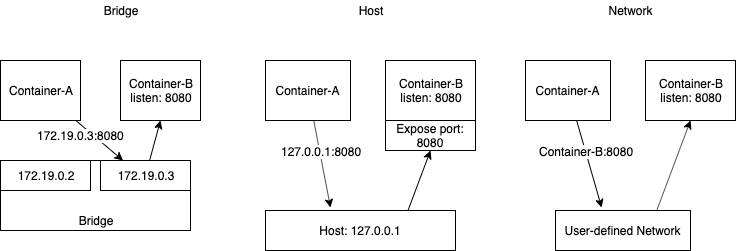

## Docker commands
Kill all containers
```
docker kill $(docker ps -qa)
```
Remove all
```
docker system prune -a
```
Docker networks


Docker build, tag and push to dockerhub
```
docker build --tag tagname .
docker images
docker tag a287b0bb607d alekseysamoylov/tagname:1.0
docker push alekseysamoylov/tagname
```

Docker Mac OS autocomplete
```
1. Install ohmyz.sh https://ohmyz.sh/
2. curl -L https://raw.githubusercontent.com/docker/compose/master/contrib/completion/zsh/_docker-compose > ~/.zsh/completion/_docker-compose
3. curl -L https://raw.githubusercontent.com/docker/docker-ce/master/components/cli/contrib/completion/zsh/_docker > ~/.zsh/completion/_docker
4.  vim ~/.zshrc
	1. plugins=(... docker docker-compose)
	2. fpath+=($ZSH/plugins/docker)
5. autoload -U compinit && compinit
```

Docker image meta info
```
docker inspect --format "{{ index .Config.Labels \"buildVersion\"}}" docker_container_1
```
