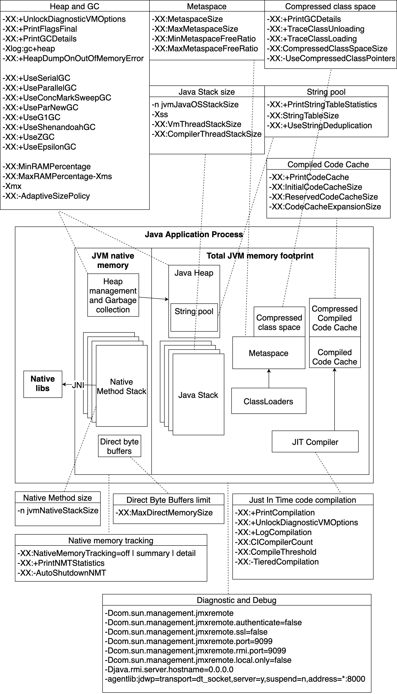

## JVM Memory



```
-XX:+UnlockDiagnosticVMOptions 
-XX:+PrintFlagsFinal 
-XX:+PrintGCDetails
-Xlog:gc+heap
-XX:+HeapDumpOnOutOfMemoryError

-XX:+UseSerialGC
-XX:+UseParallelGC
-XX:+UseConcMarkSweepGC
-XX:+UseParNewGC 
-XX:+UseG1GC
-XX:+UseShenandoahGC
-XX:+UseZGC
-XX:+UseEpsilonGC 

-XX:MinRAMPercentage
-XX:MaxRAMPercentage-Xms
-Xmx
-XX:-AdaptiveSizePolicy

-XX:MetaspaceSize
-XX:MaxMetaspaceSize
-XX:MinMetaspaceFreeRatio
-XX:MaxMetaspaceFreeRatio

-n jvmJavaOSStackSize
-Xss
-XX:VmThreadStackSize
-XX:CompilerThreadStackSize

-XX:+PrintGCDetails 
-XX:+TraceClassUnloading 
-XX:+TraceClassLoading
-XX:CompressedClassSpaceSize
-XX:-UseCompressedClassPointers

-XX:+PrintStringTableStatistics
-XX:StringTableSize
-XX:+UseStringDeduplication

-XX:+PrintCodeCache
-XX:InitialCodeCacheSize
-XX:ReservedCodeCacheSize 
-XX:CodeCacheExpansionSize 

-n jvmNativeStackSize 

-XX:MaxDirectMemorySize

-XX:NativeMemoryTracking=off | summary | detail  
-XX:+PrintNMTStatistics 
-XX:-AutoShutdownNMT

-XX:+PrintCompilation

-XX:+UnlockDiagnosticVMOptions 
-XX:+LogCompilation
-XX:+PrintFlagsFinal

-XX:CICompilerCount
-XX:CompileThresholdn
-XX:-TieredCompilation

-Dcom.sun.management.jmxremote 
-Dcom.sun.management.jmxremote.authenticate=false 
-Dcom.sun.management.jmxremote.ssl=false 
-Dcom.sun.management.jmxremote.port=9099 
-Dcom.sun.management.jmxremote.rmi.port=9099 
-Dcom.sun.management.jmxremote.local.only=false 
-Djava.rmi.server.hostname=0.0.0.0 
-agentlib:jdwp=transport=dt_socket,server=y,suspend=n,address=0.0.0.0:8000
```
